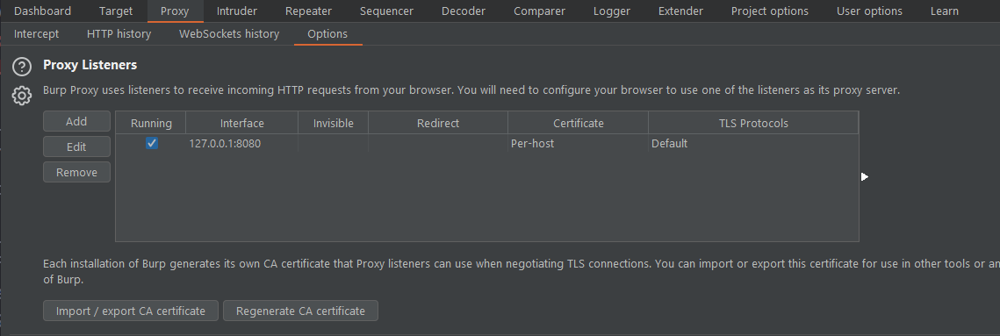
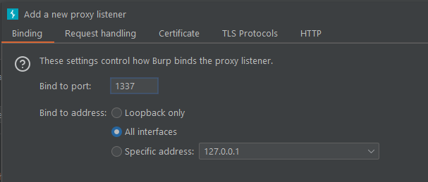
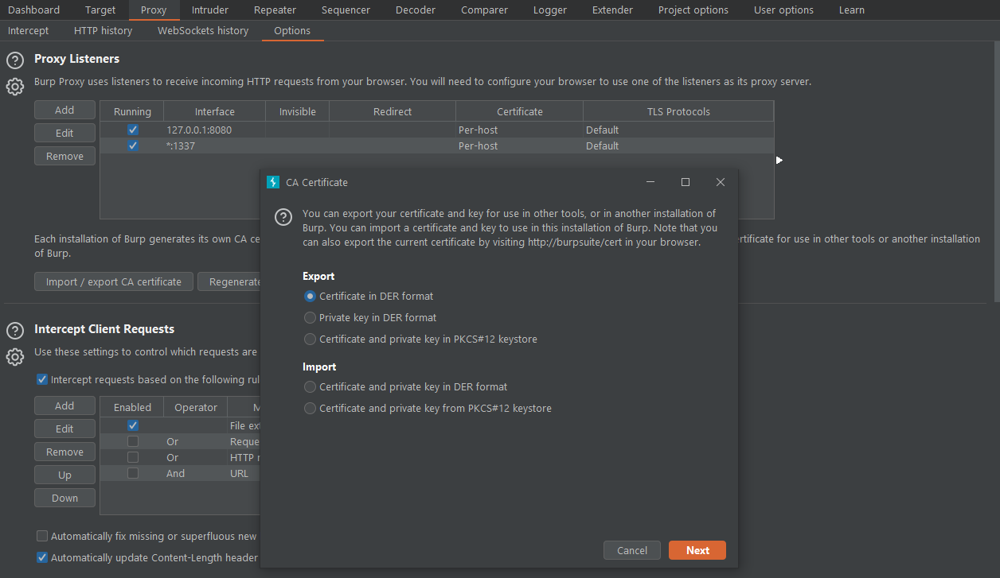
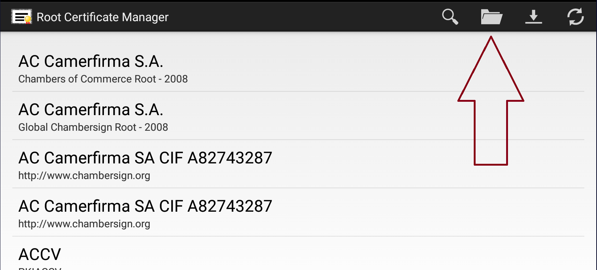
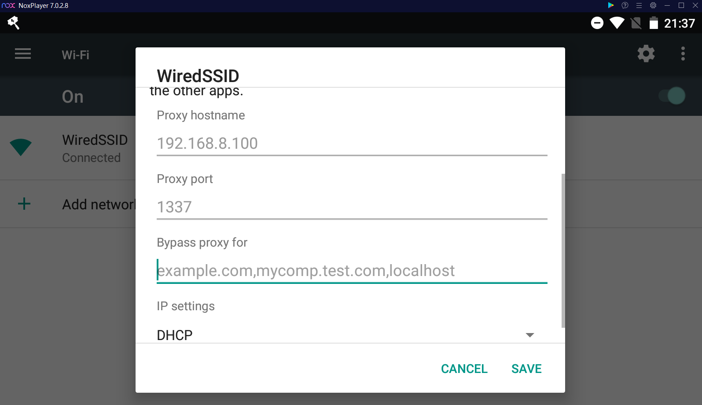
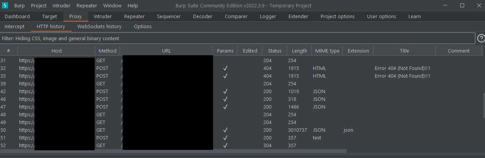

# Capturing Android app traffic
> Notice: This tutorial uses some ***ABSOLUTELY PROPRIETARY*** software. Use at your own responsibility. You can search for alternatives of course, for sure there exists some.

> You can use this tutorial for many apps that use HTTP or HTTPS to communicate with their servers.

MoinCaster uses HTTPS for communication so it's fairy easy. Let's start.

## Requirements
1. **Rooted android emulator or device** - I use NoxPlayer coz it's easy to Root, you have to click one button. ***Take care while installing NoxPlayer! It want to install some shitty antivirus, VPN client and Opera, you must deny it.***
3. **Root Certificate Manager** - Installed on your android system. You can download it from Google Play - https://play.google.com/store/apps/details?id=net.jolivier.cert.Importer&hl=pl&gl=US
2. **Burp Suite Community** - Free version of Burp suite allows you to proxy HTTP and HTTPS traffic. I tried using Postman proxy aswell but HTTPS doesn't work. Idk, maybe I did something wrong. With Burp Suite it worked with no issue at all.

## Setting up proxy
1. Open Burp Suite and go to Proxy -> Options

2. Add new proxy listener on all interaces and some port, for example 1337 
3. Now export certificate in DER format. 
4. You're done for now with Burp Suite

## Setting up Android System
1. If you read requirements you need **rooted Android device or emulator** I use Nox Player. If you use physical Android Device you must have it connected to the same network as your computer.
2. Move certificate that you exported from Burp Suite to your Android, in NoxPlayer I just have to drag and drop it into file manager.
3. Import this certificate using Root Certificate Manager. It has to be imported as **System certificate**, that's why we use Root Certificate Manager. It required system to be rooted! There are other methods of installing system trusted cert on Android but I found it to be the easiest. 
4. Go to your WiFi settings and set up Proxy. As IP you must use IP of your PC in the network. If you use NoxPlayer... I just used IP of PC in my local network aswell. Other emulators can handle it differently, search in the internet ^^ 

## It's working!
Open your MoinCaster on the Android go into Proxy -> HTTP History in Burp Suite and look at all those HTTPS request made by the app! Now you can start finding out how game communicates with the server!

---
By Scuro Guardiano